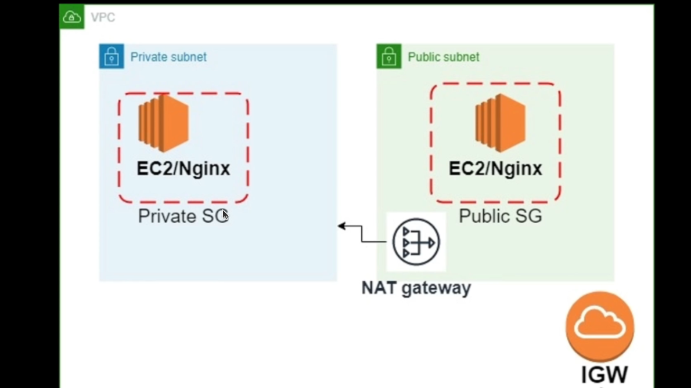

# Terraform AWS Infrastructure Project

This project uses Terraform to automate the provisioning and management of an AWS infrastructure. The setup includes a Virtual Private Cloud (VPC), multiple subnets, Security Groups, and EC2 instances, designed to create a scalable, secure environment for deploying web applications.


Here's a more detailed README file for your Terraform project, covering all essential sections to help you and others understand, set up, and use the project effectively.

README.md
markdown
Copy code
# Terraform AWS Infrastructure Project

This project uses Terraform to automate the provisioning and management of an AWS infrastructure. The setup includes a Virtual Private Cloud (VPC), multiple subnets, Security Groups, and EC2 instances, designed to create a scalable, secure environment for deploying web applications.

## Table of Contents

- [Overview](#overview)
- [Architecture](#architecture)
- [Prerequisites](#prerequisites)
- [Project Structure](#project-structure)
- [Getting Started](#getting-started)
- [Usage](#usage)
- [Terraform Commands](#terraform-commands)
- [Monitoring and Logging](#monitoring-and-logging)
- [Cleaning Up](#cleaning-up)
- [Troubleshooting](#troubleshooting)
- [Contributing](#contributing)
- [License](#license)

## Overview

This project automates the setup of a secure AWS environment using Terraform. It includes the following components:
- A VPC with public and private subnets
- Security Groups for controlled access
- EC2 instances within these subnets
- Additional AWS resources as required by the application




## Architecture

The infrastructure created by this Terraform configuration includes:
1. **VPC**: A Virtual Private Cloud to host resources.
2. **Subnets**: One public and one private subnet in the VPC.
3. **Security Groups**: Configured to allow SSH and HTTP/HTTPS access.
4. **EC2 Instances**: 
   - Public instance accessible via SSH and HTTP/HTTPS.
   - Private instance only accessible from the public instance or other internal resources.

## Prerequisites

Before setting up this project, ensure you have the following:

- **Terraform**: Install Terraform from [here](https://www.terraform.io/downloads.html).
- **AWS Account**: You need an AWS account with programmatic access configured. Set up your credentials by running:
  ```bash
  aws configure
SSH Key Pair: An SSH key pair for accessing EC2 instances. This should be specified in the ec2.tf file.
Project Structure
The project directory contains the following files:

graphql
Copy code
.
├── main.tf              # Provider and backend configuration
├── vpc.tf               # VPC and subnets definition
├── sg.tf                # Security Groups configuration
├── ec2.tf               # EC2 instances setup
├── variables.tf         # Input variables for Terraform
├── outputs.tf           # Outputs for useful information after apply
├── terraform.tfvars     # Variable values specific to this setup
├── README.md            # Documentation of the project

## Table of Contents

- [Overview](#overview)
- [Architecture](#architecture)
- [Prerequisites](#prerequisites)
- [Project Structure](#project-structure)
- [Getting Started](#getting-started)
- [Usage](#usage)
- [Terraform Commands](#terraform-commands)
- [Monitoring and Logging](#monitoring-and-logging)
- [Cleaning Up](#cleaning-up)
- [Troubleshooting](#troubleshooting)
- [Contributing](#contributing)
- [License](#license)

## Overview

This project automates the setup of a secure AWS environment using Terraform. It includes the following components:
- A VPC with public and private subnets
- Security Groups for controlled access
- EC2 instances within these subnets
- Additional AWS resources as required by the application

## Architecture

The infrastructure created by this Terraform configuration includes:
1. **VPC**: A Virtual Private Cloud to host resources.
2. **Subnets**: One public and one private subnet in the VPC.
3. **Security Groups**: Configured to allow SSH and HTTP/HTTPS access.
4. **EC2 Instances**: 
   - Public instance accessible via SSH and HTTP/HTTPS.
   - Private instance only accessible from the public instance or other internal resources.

## Prerequisites

Before setting up this project, ensure you have the following:

- **Terraform**: Install Terraform from [here](https://www.terraform.io/downloads.html).
- **AWS Account**: You need an AWS account with programmatic access configured. Set up your credentials by running:
  ```bash
  aws configure
